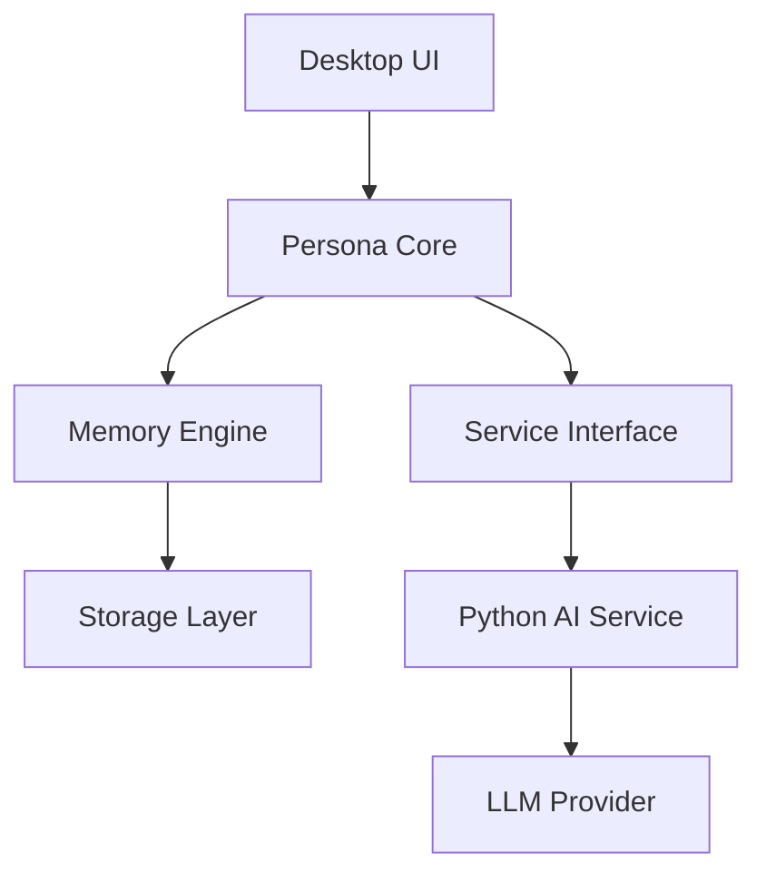
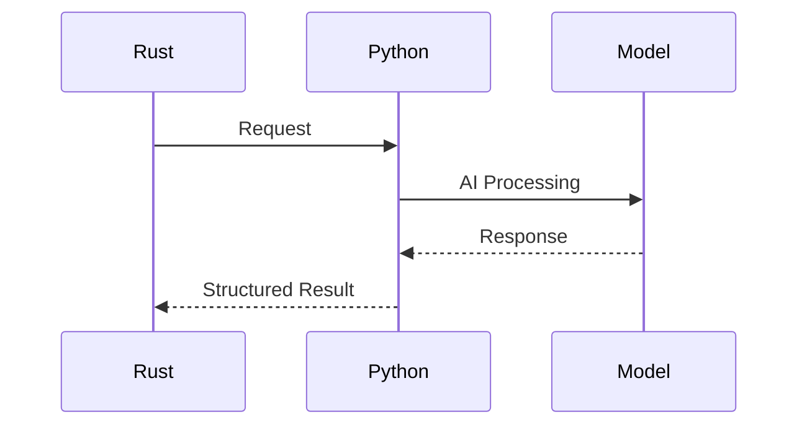

# ARCHITECTURE.md

# Persona System Architecture

**Project:** Persona

**Version:** 1.0

**Status:** Draft

---

# Overview

This document defines the official software architecture of Persona.

It serves as the single source of truth for all architectural decisions.

Any implementation should conform to this document.

Whenever implementation and architecture conflict, the architecture should be reviewed before code is modified.

---

# System Vision

Persona is a **Local-First Personal AI Reply Agent**.

Unlike traditional AI assistants, Persona is designed as a continuously evolving software platform that understands its user through long-term interaction.

Its core capability is **building an internal representation of the user** rather than simply calling a language model.

The language model is only one component of the system.

Memory, user modeling, communication style, and long-term evolution are equally important.

---

# Architectural Goals

The architecture is designed to satisfy the following goals:

* Local-first execution
* Privacy preservation
* Long-term maintainability
* High modularity
* Replaceable components
* Stable interfaces
* Explainable AI behavior
* Incremental evolution

---

# High-Level Architecture



The architecture intentionally separates **application responsibilities** from **AI capabilities**.

---

# Architectural Layers

Persona consists of six logical layers.

```text
Presentation Layer

↓

Application Layer

↓

Domain Layer

↓

Infrastructure Layer

↓

AI Service Layer

↓

Model Provider Layer
```

Each layer depends only on the layer directly below it.

Cross-layer dependencies should be avoided.

---

# Layer Responsibilities

## Presentation Layer

Responsible for user interaction.

Responsibilities include:

* desktop windows
* settings
* notifications
* system tray
* debugging tools

The presentation layer must not contain business logic.

---

## Application Layer

Coordinates system behavior.

Responsibilities include:

* runtime
* scheduling
* service orchestration
* event dispatch
* lifecycle management

This layer controls the application.

---

## Domain Layer

Contains Persona's core business concepts.

Examples:

* Memory
* Conversation
* User Profile
* Reply
* Relationship

Business rules belong here.

The domain layer should remain independent of external technologies.

---

## Infrastructure Layer

Provides technical implementations.

Examples:

* SQLite
* configuration
* logging
* plugin loading
* HTTP client
* filesystem

Infrastructure supports the domain layer.

The domain layer should never depend on infrastructure implementations.

---

## AI Service Layer

Provides intelligent capabilities.

Responsibilities include:

* memory extraction
* style analysis
* prompt construction
* semantic retrieval
* reply generation
* embeddings

The AI Service should expose capabilities rather than model implementations.

---

## Model Provider Layer

Abstracts different language models.

Examples:

* Ollama
* OpenAI
* Anthropic
* Local GGUF

Persona should never depend directly on a specific model provider.

---

# Rust–Python Separation

Persona intentionally separates the application runtime from AI computation.

## Rust Responsibilities

Rust owns:

* runtime
* storage
* event system
* scheduler
* plugin system
* desktop application
* IPC
* lifecycle

Rust represents the operating system of Persona.

---

## Python Responsibilities

Python owns:

* LLM interaction
* prompt engineering
* memory extraction
* embedding
* semantic retrieval
* reply generation
* communication style analysis

Python represents Persona's intelligence.

---

# Communication Architecture

Rust and Python communicate through service interfaces.



Rust should never access Python internals.

Python should never manipulate Rust runtime state.

Communication should use structured data formats.

---

# Core Domain Model

Persona revolves around six core entities.

```text
Conversation

↓

Memory

↓

User Profile

↓

Relationship

↓

Context

↓

Reply
```

Each entity has its own lifecycle.

No entity should become responsible for another.

---

# Data Flow

The standard processing pipeline is:

```text
Incoming Message

↓

Conversation Storage

↓

Memory Extraction

↓

Memory Update

↓

User Model Update

↓

Context Construction

↓

Reply Generation

↓

Reply Suggestion
```

Conversation history is immutable.

Memory evolves.

User profiles evolve.

Replies are generated dynamically.

---

# Memory Architecture

Memory is divided into independent categories.

* Short-Term Memory
* Long-Term Memory
* Semantic Memory
* Episodic Memory
* Preference Memory
* Relationship Memory

Each category has different update strategies.

Conversation history is **not** memory.

Memory is derived from conversation history.

---

# User Model

The user model consists of multiple independent dimensions.

Examples:

* Interests
* Skills
* Projects
* Communication Style
* Preferences
* Relationships

The model should evolve continuously.

No manual editing should be required under normal circumstances.

---

# Event-Driven Runtime

Persona should use an event-driven architecture.

Example events include:

* MessageReceived
* MemoryUpdated
* ReplyRequested
* ProfileChanged
* PluginLoaded

Components communicate through events rather than direct dependencies.

This minimizes coupling.

---

# Storage Architecture

Storage should be abstracted behind repositories.

Possible implementations include:

* SQLite
* DuckDB
* Vector Index
* Future Graph Database

Business logic should remain unaware of storage details.

---

# Plugin Architecture

Plugins extend Persona without modifying the core.

Possible plugin types include:

* Message Collectors
* Communication Platforms
* AI Providers
* Exporters
* Importers

Plugins communicate through stable interfaces.

---

# AI Capability Architecture

The AI Service exposes capabilities.

Examples:

* ExtractMemory
* AnalyzeStyle
* GenerateReply
* RetrieveContext
* GenerateEmbedding

Capabilities remain stable even if internal AI implementations change.

---

# Architectural Constraints

The following constraints are mandatory.

The UI must not access databases directly.

Business logic must not depend on GUI frameworks.

Rust must not directly invoke model-specific APIs.

Python must not contain application lifecycle logic.

Storage implementations must remain replaceable.

Model providers must remain replaceable.

Every subsystem must expose clear interfaces.

---

# Cross-Cutting Concerns

The following concerns affect all modules.

* Logging
* Error Handling
* Configuration
* Security
* Privacy
* Performance
* Observability

These concerns should be implemented consistently across the project.

---

# Future Evolution

The architecture should support future extensions such as:

* Voice interaction
* Multi-device synchronization
* Federated learning
* Multi-modal understanding
* Calendar integration
* Email assistance
* Browser integration

These features should be added without changing the existing architectural boundaries.

---

# Architecture Principles

Persona values:

* Simplicity over cleverness.
* Interfaces over implementations.
* Composition over inheritance.
* Modularity over coupling.
* Local execution over cloud dependency.
* Long-term maintainability over rapid feature growth.

Every architectural decision should reinforce these principles.

---

# Conclusion

Persona is designed as a software platform rather than a single AI application.

Its long-term value comes from the interaction between memory, user modeling, communication style, and intelligent reply generation.

The architecture intentionally separates business logic, infrastructure, and AI capabilities to ensure long-term maintainability and continuous evolution.

Every future subsystem should integrate into this architecture rather than extending it through shortcuts.
