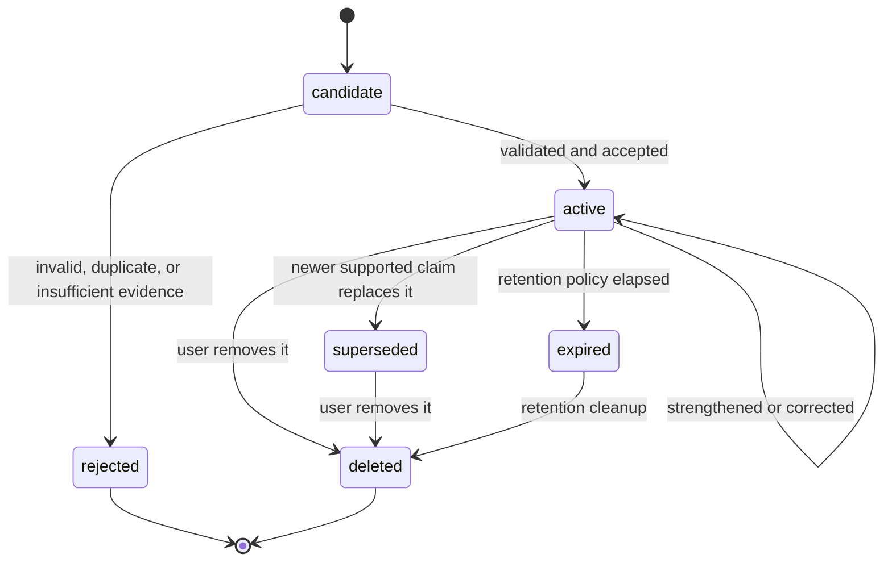

# Persona Memory System Specification

**Project:** Persona
**Version:** 1.1
**Status:** Draft

## 1. Purpose and Boundaries

Memory is Persona's derived, editable representation of meaningful information from immutable conversation records. It supports user modeling, personalized reply suggestions, long-term context, relationship understanding, and preference learning.

Memory is not a transcript, a generic vector store, or an authority over the user. Conversation history remains the source of truth. A memory can point to one or more source messages, but it must not duplicate raw conversation content unless the user explicitly saves a quotation.

The system remembers selectively, forgets deliberately, and explains every retained item. It must never send messages, impersonate the user, or make social decisions on the user's behalf.

## 2. Design Goals

- Learn continuously from user-authorized local conversation data.
- Retain useful, structured information rather than every utterance.
- Keep facts, preferences, experiences, relationships, and communication style distinct.
- Support confidence, importance, change, conflict, expiry, and forgetting.
- Make provenance, reasoning, and user controls visible.
- Keep storage, retrieval, and model providers replaceable.

## 3. Memory Model

Memory is described along independent axes. This avoids treating time horizon, semantic meaning, and storage format as the same concept.

### 3.1 Semantic Kind

| Kind | Meaning | Example |
| --- | --- | --- |
| `fact` | A claim about the user or their environment | The user develops Persona in Rust |
| `preference` | A stated or learned choice | The user prefers concise replies |
| `episode` | A dated event or experience | The user started a project this week |
| `relationship` | Contact-scoped context or preference | A colleague prefers formal communication |
| `style` | An observation about user-authored expression | The user usually avoids emojis in work messages |
| `context` | A temporary task, topic, or conversational state | The current discussion concerns a release plan |

### 3.2 Retention Class

`short_term` context is session-scoped and expires automatically. `long_term` memory is retained only while it remains useful, supported by evidence, and permitted by the user. Semantic kind does not determine retention: an episode can be useful long term, and a fact can be temporary.

### 3.3 Structured Payload

Every memory includes a user-readable normalized summary and a typed payload. A `fact`, `preference`, or `relationship` payload may use an optional subject-predicate-object form; this is not mandatory for episodes, style observations, or context. Payload schemas are versioned per kind.

Example fact payload:

```yaml
subject: user
predicate: develops
object: Persona
qualifiers:
  language: Rust
```

The normalized summary enables user review and retrieval. It is a derived statement, not a replacement for source conversation content.

## 4. Required Record Fields

Every persisted memory record includes:

| Field | Requirement |
| --- | --- |
| `id` | Stable unique identifier |
| `owner_id` | Local user scope; mandatory on every query and write |
| `kind` | One of the semantic kinds above |
| `retention_class` | `short_term` or `long_term` |
| `scope` | Optional contact, conversation, project, or global scope |
| `summary` | User-readable normalized statement |
| `payload` | Versioned structured data for the selected kind |
| `confidence` | Evidence-based belief in accuracy, from 0.0 to 1.0 |
| `importance` | Retention and personalization value, from 0.0 to 1.0 |
| `state` | Lifecycle state defined below |
| `source_refs` | One or more conversation and message identifiers |
| `rationale` | Why the candidate was extracted or changed |
| `created_at`, `updated_at`, `last_used_at` | Lifecycle timestamps |
| `expires_at` | Required for short-term memory; optional otherwise |
| `lock_state`, `pin_state` | User-control flags |
| `schema_version` | Payload contract version |

Audit history records each transition, its actor (`user` or `system`), the reason, and the affected source references. Raw provider responses and credentials are never stored in a memory record.

## 5. Lifecycle



States are `candidate`, `active`, `superseded`, `expired`, `rejected`, and `deleted`. `candidate` and `rejected` records may be retained only as minimal audit metadata according to local retention policy. Deleted memories are excluded from retrieval and cannot be restored by automatic updates; a newly observed source may create a new candidate.

`superseded` preserves historical evidence without remaining current. `expired` represents policy-driven end of usefulness. The system must not silently overwrite or erase an active claim to resolve a conflict.

## 6. Extraction and Validation Pipeline


1. Store the conversation record unchanged.
2. The AI service returns candidate memories, source references, confidence signals, and rationales.
3. The application validates ownership, schema, source existence, scope, and policy restrictions.
4. Compare each candidate with active memories for equivalence, support, and contradiction.
5. Respect locks, user edits, and disabled learning before creating or changing a record.
6. Persist a validated transition and audit record atomically.

The AI service proposes candidates only. It does not write application storage or decide a memory's final lifecycle state.

## 7. Confidence, Importance, and Freshness

Confidence answers: "How well supported is this claim?" Importance answers: "How valuable is this information for long-term personalization?" They must not be conflated.

Confidence can increase through repeated independent evidence, explicit confirmation, or a user edit. It decreases when evidence becomes stale or contradictory. A model's self-reported certainty is only one signal and never sufficient proof by itself.

Importance is informed by user pinning, relationship or task relevance, durability, and repeated retrieval value. It must not be used to retain sensitive data merely because it appears useful. Freshness affects retrieval ranking but does not silently change the claim's truth value.

## 8. Deduplication and Conflict Resolution

Equivalent candidates merge evidence into one active memory when their kind, owner, scope, and normalized meaning match. Merging preserves all source references and audit history.

Contradictory claims coexist until resolved. The system may lower confidence, mark an older claim superseded when a newer claim is sufficiently supported, or ask the user for confirmation. User edits and locks are authoritative. A relationship preference is never generalized to a global user preference without separate evidence.

## 9. Forgetting and Retention

Forgetting is an intentional feature. A memory may expire because it is temporary, obsolete, weakly supported, contradicted, unused, or removed by the user. Retention rules are deterministic per kind and retention class, and must be inspectable.

Short-term context always has an expiry. Long-term memories are periodically reviewed using freshness, confidence, importance, user controls, and active conflicts. `last_used_at` is a retrieval signal, not a reason to keep an otherwise invalid memory indefinitely.

## 10. Retrieval and Reply Use

Retrieval combines structured filtering, semantic similarity, temporal relevance, relationship scope, confidence, importance, freshness, and user controls. Embedding search is optional and never the sole source of truth.

The context builder retrieves the minimum relevant set for a request. It returns each selected memory's identifier, summary, source references, confidence, freshness, and selection rationale. Prompt construction must not inject memories blindly, and the generated reply must be traceable to the context it used.

## 11. User Control and Explainability

Users can inspect, edit, delete, export, lock, pin, or disable learning for memories.

- A **lock** prevents automated overwrite, merge, expiry, or deletion until the user changes it.
- A **pin** raises retrieval or retention priority but does not make a claim immutable.
- A **delete** removes the memory from retrieval and future automated updates.
- Disabling learning prevents new automatic candidates for the selected scope.

For every memory, Persona must show its summary, category, confidence, importance, state, sources, extraction rationale, and update history. For every reply that uses memory, Persona must be able to explain which memories were selected and why.

## 12. Privacy, Storage, and Extensions

Memories are local by default and remain independent of storage technology. SQLite stores records and audit metadata; optional local vector indexes store embeddings only for approved memory content. Conversation storage, database lifecycle, export, backup, and deletion propagation follow [DATABASE.md](DATABASE.md).

The system minimizes data supplied to optional cloud providers and obeys the request's authorized context policy. Sensitive attributes require explicit user input or confirmation; they must not be inferred solely from conversational patterns.

Future capabilities such as voice, visual, or multi-device memory may add new payload schemas only when they preserve this lifecycle, provenance, privacy, and user-control model. They do not broaden Persona into an autonomous messaging or social-decision system.

## 13. Acceptance Criteria

The Memory System is ready for implementation when tests can demonstrate that:

- conversations remain immutable while memories are derived and auditable;
- candidate validation rejects missing or unauthorized source references;
- equivalent evidence merges without losing provenance;
- conflicts preserve history and respect user edits;
- locked and deleted memories cannot be automatically changed or retrieved;
- retrieval provides minimal, scoped context with an explanation; and
- expiry and export operate locally and predictably.
