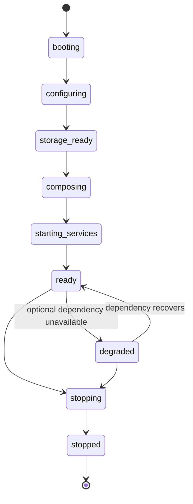

# Persona Runtime Architecture

**Project:** Persona
**Version:** 1.1
**Status:** Draft

## 1. Purpose and Boundary

The Rust runtime is Persona's composition and lifecycle layer. It starts, connects, monitors, and stops application infrastructure so domain services can operate predictably. It owns application-wide coordination, local configuration, event delivery, managed background work, plugin lifecycle, and the desktop application's readiness state.

The runtime is not a service locator and does not contain business rules. It must not perform memory extraction, prompt construction, embedding, reply generation, model-specific logic, or direct UI business logic. Those responsibilities remain in domain services and the Python AI service.

## 2. Design Principles

- **Local-first:** offline operation and locally stored user data are the default.
- **Explicit composition:** dependencies are constructed once at the composition root and passed through typed interfaces.
- **Deterministic lifecycle:** startup and shutdown order are explicit, observable, and testable.
- **Graceful degradation:** optional services can fail without corrupting data or blocking basic local access.
- **Structured concurrency:** background work is owned, cancellable, bounded, and observable.
- **Privacy by default:** configuration, logs, health reports, and errors must not reveal private content.
- **Loose coupling:** events announce facts; typed service interfaces handle commands and queries.

## 3. Runtime Components

| Component | Responsibility | Boundary |
| --- | --- | --- |
| Application entry | Creates the composition root and receives OS lifecycle signals | Does not contain domain rules |
| Configuration service | Loads, validates, versions, and observes local settings | Secrets are stored separately |
| Storage bootstrap | Opens local stores, runs migrations, and creates repositories | Repositories own data operations |
| Service composition | Wires typed repositories, domain services, clients, and UI adapters | Not available as a global service locator |
| Event dispatcher | Delivers typed domain events to registered handlers | Does not replace commands or queries |
| Task supervisor | Runs scheduled and long-lived tasks with cancellation and limits | Tasks do not outlive the runtime |
| Plugin manager | Discovers, validates, approves, starts, and stops plugins | Enforces [PLUGIN.md](PLUGIN.md) permissions |
| AI service client | Calls the Python AI service and reports availability | Implements [IPC.md](IPC.md) only |
| Health registry | Aggregates readiness and degradation state | Reports metadata, never private content |
| Desktop adapter | Exposes safe runtime state to the presentation layer | UI does not access storage directly |

## 4. Lifecycle and Readiness

Managed components expose lifecycle operations appropriate to their type: `initialize`, `start`, `health`, and `stop`. They must be idempotent where practical. The runtime tracks state transitions and cannot report `ready` before required dependencies are usable.

### 4.1 Dependency Criticality

| Class | Examples | Startup behavior |
| --- | --- | --- |
| Required | Valid configuration, local storage, repository migrations, event dispatcher | Failure stops startup without partial writes |
| Optional | AI service, cloud provider, nonessential plugin, index maintenance task | Failure enters degraded mode and remains visible to the user |

Degraded mode preserves access to existing local data and settings. It does not silently fall back to a cloud provider, enable a plugin, or send data externally.

## 5. Startup Sequence

1. Receive the application start signal and create a root cancellation token.
2. Load and validate local configuration; load secrets through the local secret mechanism.
3. Initialize privacy-safe logging, metrics, and error reporting.
4. Open and migrate local storage; construct repositories.
5. Compose domain services, event handlers, the AI service client, and desktop adapters through typed interfaces.
6. Start the event dispatcher and required supervised tasks.
7. Discover and validate plugins; start only user-approved plugins with granted permissions.
8. Connect to or launch the configured loopback AI service.
9. Publish readiness and degradation state to the desktop UI.

Services may initialize their own internal resources, but they must not independently start unrelated services or bypass the runtime's ordering and cancellation controls.

## 6. Events, Commands, and Queries

Events announce facts that have already occurred, for example `MessageReceived`, `MemoryUpdated`, `ProfileChanged`, `ReplyRequested`, `ReplyGenerated`, and `PluginLoaded`. Commands request work through a typed domain-service interface; queries return data through repositories or read services. A synchronous reply request, for example, is not implemented by broadcasting an event and hoping a handler responds.

Every event includes an event identifier, schema version, timestamp, owner scope, correlation identifier, producer, and typed payload. Event consumers must be idempotent because delivery can be retried. Handlers record failures with safe metadata and use bounded queues or backpressure rather than unbounded task creation.

Events do not grant access to data. A handler receives only the identifiers and fields required for its responsibility, then uses authorized domain interfaces for further work.

## 7. Task Supervision and Scheduling

The task supervisor owns long-running and scheduled work such as collector monitoring, retention cleanup, memory maintenance, plugin heartbeats, health checks, and index maintenance.

Each task has an owner, cancellation token, deadline or interval, concurrency limit, retry policy, health contribution, and correlation identifier. Retries are limited and permitted only when the operation is idempotent. A task failure updates health state and must not crash unrelated components. No task may block the UI or outlive runtime shutdown.

Scheduling configuration is local and user-controlled. Learning, collection, plugin execution, and optional provider activity can be disabled by scope or globally.

## 8. AI Service Integration

The runtime uses an AI service client, not direct model-provider APIs. The initial client communicates with the Python service through authenticated local HTTP on loopback, following [IPC.md](IPC.md).

The client owns request deadlines, correlation, bounded retries for idempotent capabilities, availability checks, and conversion of transport errors into typed application errors. It cannot persist memory, access databases, fetch extra context, or send external messages. The Python service's health is optional: its unavailability disables affected AI capabilities while the runtime remains available in degraded mode.

## 9. Plugins

The plugin manager follows discovery, validation, user approval, initialization, active, disabled, and unload states. It validates manifests and permissions before a plugin receives access to any host capability. Plugin failures are isolated and reported through health and lifecycle events.

Plugins cannot modify the runtime, access database internals, bypass permission checks, or autonomously send messages. Hot reload and process sandboxing are future capabilities, not assumptions of the initial runtime.

## 10. Configuration, Logging, and Health

Configuration is local, versioned, and separate from secrets. Defaults preserve offline operation. Changes to provider enablement, data retention, learning, collectors, or plugin permissions require explicit user action and an audit record.

Logging is initialized once by the runtime. Logs and health reports include component name, lifecycle transition, severity, correlation identifier, error category, and latency where relevant. They exclude conversation text, memory values, prompts, credentials, tokens, and raw provider responses.

Components report `healthy`, `degraded`, or `unavailable`, with a safe reason and last transition time. The health registry aggregates those reports for diagnostics and the UI; it does not expose private data.

## 11. Shutdown and Recovery

On shutdown, the runtime:

1. Stops new intake and signals cancellation to supervised tasks.
2. Drains or cancels in-flight work within bounded deadlines.
3. Completes approved transactional writes and records safe recovery metadata for interrupted work.
4. Stops plugins and optional services in reverse dependency order.
5. Flushes logs and closes repositories and storage.
6. Publishes the stopped state before process exit.

Unexpected termination must not leave conversations partially mutated. Recovery on the next startup relies on transactional storage, idempotency keys, and recorded lifecycle state rather than replaying arbitrary provider requests.

## 12. Acceptance Criteria

The runtime is ready for Phase 1 implementation when tests demonstrate that:

- required storage failure prevents startup without corrupting local data;
- optional AI or plugin failure enters visible degraded mode while local data remains accessible;
- startup and shutdown follow the documented order;
- events are versioned, owner-scoped, idempotently handled, and bounded under load;
- supervised tasks are cancellable and cannot outlive shutdown;
- configuration changes affecting privacy or external access require explicit user action; and
- runtime logs, errors, and health reports contain no private conversation or credential content.
